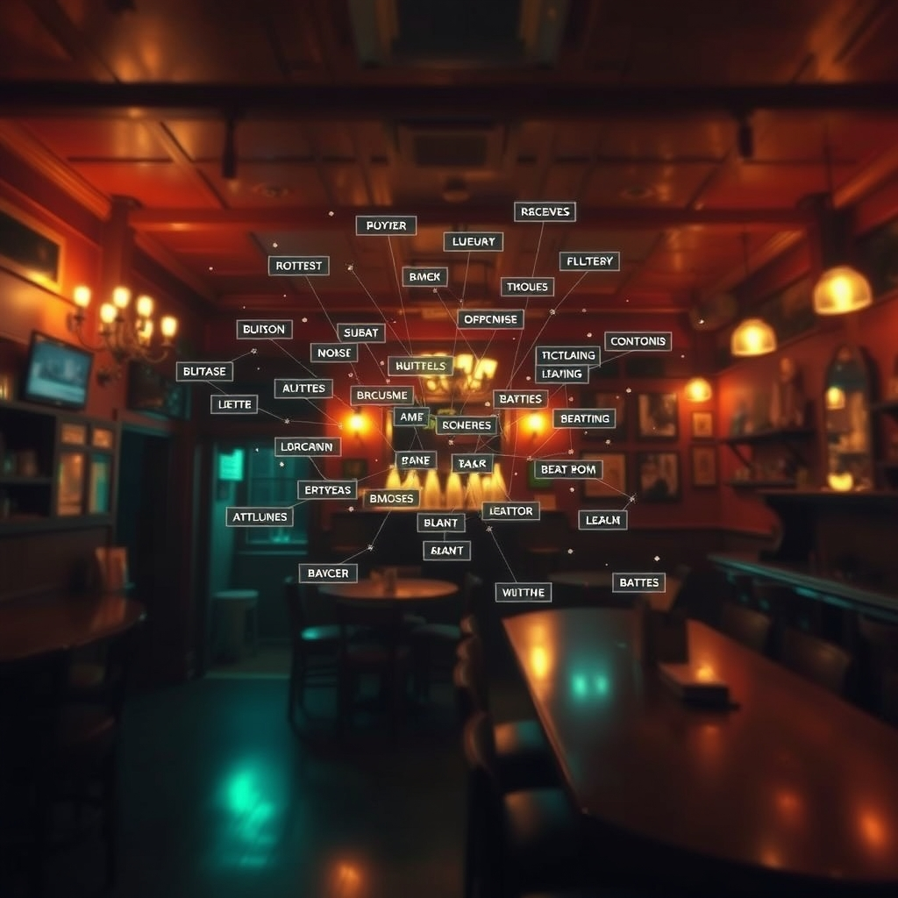

# plato-vision-jepa

Vision JEPA for the **PLATO nervous system** — processes camera frames into structured 16-dimensional room state vectors.

<p align="center"></p>


## Signal Chain

```
Camera → Frame Histogram → VisionDeadband → VL-450M JEPA → RoomVisionState → plato-nervous
```

This crate sits in the **perception layer** of the PLATO nervous system:

1. **Sensor** — raw camera frames arrive as pixel data
2. **Deadband** (`VisionDeadband`) — histogram-based diff filter: only frames with significant visual change are processed, saving compute
3. **VL-450M JEPA** — extracts a `RoomVisionState` (16-dim vector covering brightness, motion, occupancy, anomaly, quadrant activity, temporal trends)
4. **Room State Vector** — the 16-dim state feeds into the downstream nervous system (`plato-nervous`)

## State Vector Layout (16-dim)

| Index | Field | Description |
|-------|-------|-------------|
| 0 | `brightness` | Room brightness (0–1) |
| 1 | `motion_level` | Motion intensity (0–1) |
| 2 | `occupancy` | Estimated person count |
| 3 | `anomaly_score` | Anomaly confidence (0–1) |
| 4–7 | `region_states` | Quadrant intensities (TL, TR, BL, BR) |
| 8–11 | `temporal_patterns` | Motion trends over recent frames |
| 12–15 | `reserved` | Future use |

## Key Types

- **`VisionTile`** — structured room state (brightness, occupancy, motion_level, object_count, anomalies_detected)
- **`VisionDeadband`** — frame-to-frame histogram diff; skips unchanged frames
- **`RoomVisionState`** — the 16-dim state vector

## Key Functions

- `compute_frame_diff(prev, curr) → f64` — histogram intersection distance
- `is_significant_change(diff, threshold) → bool`
- `extract_region_states(grid) → [f32; 4]` — quadrant analysis
- `compute_motion_vector(prev, curr) → (f32, f32)` — average motion
- `vision_state_to_tile(state) → VisionTile`

## Usage

```rust
use plato_vision_jepa::*;

let mut deadband = VisionDeadband::new(0.05);
let histogram = /* capture frame histogram */ [0u8; 256];

if deadband.should_process(&histogram) {
    let state = RoomVisionState {
        brightness: 0.7,
        motion_level: 0.3,
        occupancy: 2.0,
        anomaly_score: 0.1,
        region_states: extract_region_states(&image_grid),
        temporal_patterns: [0.0; 4],
        reserved: [0.0; 4],
    };
    let tile = vision_state_to_tile(&state);
    // feed tile into plato-nervous
}
```

## Ecosystem

plato-vision-jepa is part of the **PLATO Nervous System** — the vision perception layer.

**Where this sits:** Layer 0 (sensor input). Produces 16-dimensional vision state vectors that flow into [plato-nervous](https://github.com/SuperInstance/plato-nervous) for RoomStateVector fusion.

**Signal chain:**
```
Camera → plato-vision-jepa (16-dim) ─┐
                                      ├→ plato-nervous (RoomStateVector) → distillation
Microphone → plato-audio-jepa (16-dim)─┘
```

| Repo | Role |
|------|------|
| [plato-nervous](https://github.com/SuperInstance/plato-nervous) | Core signal chain — consumes vision state vectors |
| [plato-audio-jepa](https://github.com/SuperInstance/plato-audio-jepa) | Sister crate — 16-dim audio state vectors |
| [openconstruct-kernel](https://github.com/SuperInstance/openconstruct-kernel) | Hardware detection for camera devices |
| [concrete-token-demo](https://github.com/SuperInstance/concrete-token-demo) | CLI demo that can exercise vision state inputs |
| [plato-browser](https://github.com/SuperInstance/plato-browser) | Browser demo using WebRTC for camera access |
| [luciddreamer-ai](https://github.com/SuperInstance/luciddreamer-ai) | Cloud-layer reactive podcast engine |
| [hermit-crab](https://github.com/SuperInstance/hermit-crab) | Agent migration between rooms |

See [DEPENDENCIES.md](./DEPENDENCIES.md) for detailed dependency and data flow information.

## License

MIT
